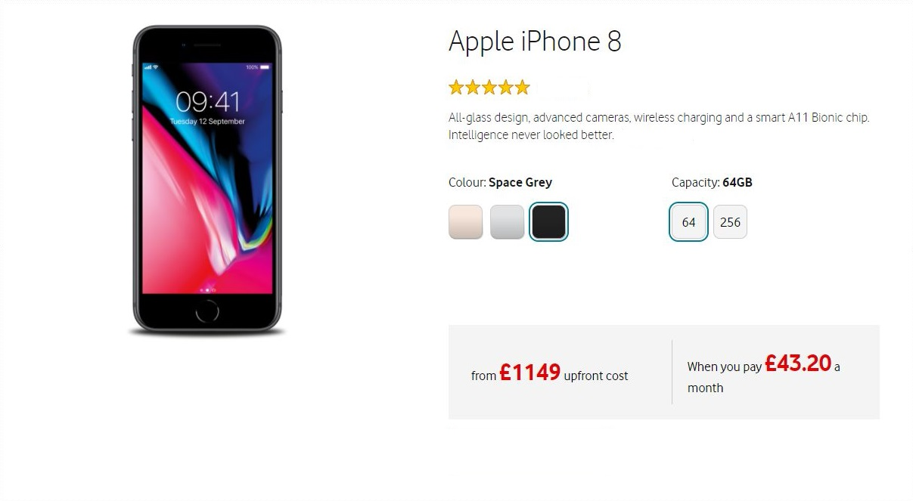

[Introduction](#introduction) | [Task](#task) | [Motivation](#motivation) | [Installation](#installation) |  [Approach](#approach) | [Challenges](#challenges) | [Further Work](#further-Work)

# Vodaphone Developer Task

## Introduction

The purpose of this exercise is to demonstrate my use of front end technologies to build a data driven component of a website.  

## Task

Create the phone component as displayed below that will display in Chrome, E11 and Firefox using the json data and image files provided.  On selection of a colour or capacity the image will change and the prices will update.


## Motivation

Since completing the Makers Academy course I have turned my attention to front end development with a focus on [React](https://reactjs.org/).  In that time I have completed tutorials and built a basic website in React.  I decided I wanted to use this opportunity to put into practice what I have been learning so I decided to also complete this task using React.  I also decided to use [Enzyme](https://github.com/airbnb/enzyme) for my tests as I have also just learned the utility but hadn't actually written any of my own tests yet.  Due to this I decided early on that I wouldn't take a TDD approach with this task, my goal was to fully understand using Enzyme and testing in React and I would be very happy with full coverage and all tests mocked where necessary.

Another focus of this project was to improve my css which I'm still very new to for a budding front end developer, so for this purpose I decided just to concentrate on core css skills and just use basic css (although I did apply [Bootstrap CDN](https://getbootstrap.com/docs/3.3/getting-started/)).


## Installation

Clone the repository then in the command line run:

```bash
$ cd vodafone_developer_task
$ npm install
$ npm start
```

To run the test and check the coverage run the below commands:

```bash
$ npm test
$ npm test -- --coverage
```

## Approach
- Firstly I wrote some user stories based upon the task presented:

```
As a user,
so that I can see what colour phone I would like to buy,
I would like to see the image of the phone colour I click on.
```
```
As a User,
so that I can see how much the package will cost,
I would like to see the cost of the capacity I click on.
```

- This really helped to have a clear goal to work towards.

- Next I set up the project using the npm command [create-react-app](https://www.npmjs.com/package/create-react-app).

- Next I decided it was imperative to the task to understand the phones.json file.  I added all the files to the project folder and imported the json file into App so that I could use the console to fully understand how all the data was stored in the file and how I would use the app to access it.

- I then looked at splitting the page into separate components to get a visual idea of how to build the app.  I split this into 4 main sections, the image, the header/summary, the selection boxes and the cost (upfront and monthly).

- I decided that the selection section would for the basis for the App as this is where the state is set and all the functionality is and this would form the parent component to the other 3 sections mentioned above.  The app would set an initial state of gold colour and 64GB capacity and on click of any of the other selections the state would change.

- One of my main goals was for the code to be reusable and maintainable.  To achieve this I ensured all  information was taken from the data file, even where it didn't seem necessary just for the purpose of this task.  I also used constants for setting the colour and capacity so that should these change it's easy for the developer to update these and the code and test will use the new data.  I also ensured all tests were mocked and where they find the selection boxes they find them by position rather than className should the colours/capacities change.

- I later extracted the star rating from the Summary component as this felt like it belonged on it's own.  If the phone rating is more than 4 it shows 5 gold stars, more than 3 it shows 4 gold stars and 1 grey star and so on.

## Challenges

- Testing in Enzyme and ensuring everything was mocked properly was probably my biggest challenge and took the largest chunk of my time.  However I eventually achieved 100% test coverage on all components with all tests mocked where necessary.

- As stated in my motivation my css skills are limited however I was very happy with how I got the project looking but I would need to look more into my design should the objectives of the task change (maybe more colours or capacities).

- Using the require function to get the source for the picture caused me a few issues and I'm not entirely sure if this is seen as good code, however using this meant that my code was a lot simpler and easily readable.  I'm also not 100% sure why this the test result doesn't include the file path.

## Further Work

- Add integration testing.  I haven't covered integration testing in React/Enzyme but I'm keen to learn and add these test to the task.

- Improve the css and ensure it's extendable.

- Possibly look into shortening the App component as it seems too large.  This could include having the constants in a separate file.

- Adding CI and CD but this wasn't something I was looking to get out of this task in the time available.
